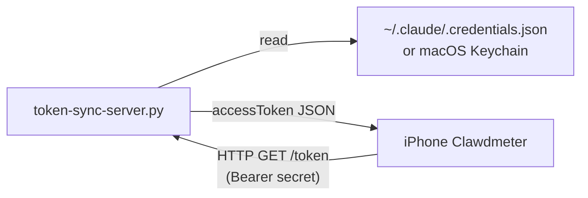

# Clawdmeter Daemon

A tiny Python HTTP server that exposes your local Claude Code OAuth
`accessToken` over the LAN so the [Clawdmeter mobile app][app] can refresh
the token automatically without you copy-pasting after every rotation.

[app]: https://github.com/squall/clawdmeter-mobile



## Install

One-liner (download to current directory, then run):

```bash
curl -fsSL -o token-sync-server.py \
  https://raw.githubusercontent.com/squall/clawdmeter-daemon/main/token-sync-server.py \
  && python3 token-sync-server.py
```

Or clone the repo:

```bash
git clone https://github.com/squall/clawdmeter-daemon.git
cd clawdmeter-daemon
python3 token-sync-server.py
```

Optional: install the `qrcode` library so the server prints a QR you can
scan from the app instead of typing the URL + secret manually.

```bash
pip3 install qrcode
```

## Use

1. Run the script in a terminal. It prints:
   - The LAN URL (e.g. `http://192.168.0.5:47821/token`)
   - A shared secret (auto-generated and stored at
     `~/.config/clawdmeter-token-sync/secret`)
   - A QR code containing both
2. Open the Clawdmeter app on your phone → Settings → LAN Token Sync.
3. Tap **掃描 QR 自動填入**, or type the URL + secret manually. Save.
4. The phone is now on the same Wi-Fi as the laptop and will refresh
   the token before each poll. Leave the script running.

The script is single-file, has no dependencies beyond the Python
standard library (qrcode is optional), and binds to your detected LAN
IP by default. Stop with `Ctrl+C`.

## Where it reads credentials

| Platform | Location |
|---|---|
| Linux | `~/.claude/.credentials.json` |
| macOS | `security find-generic-password -s "Claude Code-credentials"` (Keychain) |

These are populated by the Claude Code CLI when you log in. The daemon
never modifies them.

## Security model

This is a personal-use tool, not a hardened service. It is fine on a
home LAN; do not expose it to the internet.

- Binds to a single autodetected LAN IP by default (not `0.0.0.0`)
- Requires `Authorization: Bearer <secret>` for `/token`
- Uses constant-time comparison for the secret
- HTTP only (no TLS) — treat the secret like a Wi-Fi password

## Options

```
python3 token-sync-server.py [--host HOST] [--port PORT] [--print-secret]
```

- `--host` — bind address (default: autodetected LAN IP)
- `--port` — bind port (default: 47821)
- `--print-secret` — print URL + secret + QR, then exit

## License

MIT — do whatever you want with the code. The Clawdmeter mobile app it
pairs with has its own asset-licensing caveats; see that repo.
